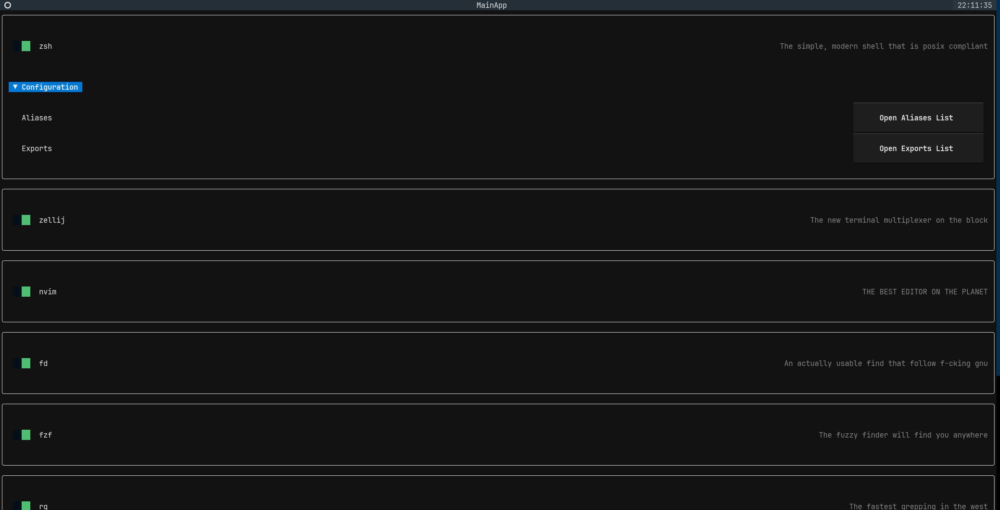
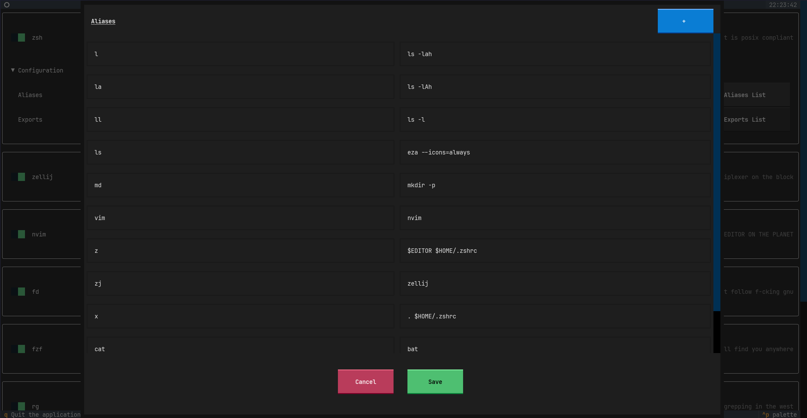

# CONFIGOLD
Like gold, you configuration should be precious but malleable

### Configure your shell easily with an easy to use user interface



### A beautifull UI


**All in the shell!**

An easy to use user interface to easily configure your setup.

Don't like to change defaults? just nextify that shi- and get a great configuration by default!

### Configure all of your shell
#### Currently supported programs
- [x] Zsh
  - [x] Installable
  - [x] Configurable (sdk)
  - [x] Configurable (UI)

- [x] Zellij
  - [x] Installable
  - [x] Configurable (sdk)
  - [x] Configurable (UI)

- [x] TMUX
  - [x] Installable
  - [x] Configurable (sdk)
  - [ ] Configurable (UI)

- [x] Neovim
  - [x] Installable
  - [ ] Configurable (sdk)
  - [ ] Configurable (UI)

- [x] fzf
  - [x] Installable

- [x] eza
  - [x] Installable

- [x] rg
  - [x] Installable

- [x] zoxide
  - [x] Installable

- [x] fd
  - [x] Installable

### Create custom scripts to install and configure
Don't like the options you have in the UI?

You can create a custom script that will install whatever program you want and create a custom script to configure it automatically!

```python
import asyncio
import logging

from apps.zsh import ZshApp, ZshConfigData
from apps.zsh.config import ZshPluginManagerType
from utils import setup_logger

zsh_config = ZshConfigData(
    plugin_manager=ZshPluginManagerType.ZINIT,
)

zsh = ZshApp(zsh_config)


async def main() -> None:
    setup_logger()

    _ = await zsh.install()
    _ = zsh.configure()
    

if __name__ == "__main__":
    asyncio.run(main())
```

The output `.zshrc`:
```bash
# Use the instant prompt (this should be the very first line in your .zshrc)
if [[ -r "/home/shaked/.local/share/zsh/resources/instant-prompt.zsh" ]]; then
  source "/home/shaked/.local/share/zsh/resources/instant-prompt.zsh"
fi

# Sourcing library files (you can ignore this)
source /home/shaked/.local/share/zsh/resources/plugin_managers/lib/lib.zsh /home/shaked/.local/share/zsh/resources

# Initialize your plugin manager here
ZINIT_HOME="/home/shaked/.local/share/zsh/resources/plugin_managers/zinit"
source "${ZINIT_HOME}/zinit.zsh"

# Setup your theme here
zinit light /home/shaked/.local/share/zsh/resources/themes/powerlevel10k

# This is the exports, they define variables that are accessible by other programs (plus the shell itself)
# You can override this to whatever you want, for example: the EDITOR env variable will define what multiple programs
# will use as their editor, for example `sudoedit` (the command to edit files as the super user)
export EDITOR="`which nvim`"

# This is the aliases, they define 'commands' that will point to other commands themself, for example: A `g` alias is just an alias to `git`
alias l="ls -lah"
alias la="ls -lAh"
alias ll="ls -l"
alias ls="eza --icons=always"
alias md="mkdir -p"
alias vim="nvim"
alias z="$EDITOR $HOME/.zshrc"
alias zj="zellij"
alias x=". $HOME/.zshrc"
alias cat="bat"
alias g="git"

# Load all of the installed plugins
zinit light /home/shaked/.local/share/zsh/resources/plugins/zsh-syntax-highlighting
zinit light /home/shaked/.local/share/zsh/resources/plugins/zsh-autosuggestions
zinit light /home/shaked/.local/share/zsh/resources/plugins/zsh-vi-mode
zinit light /home/shaked/.local/share/zsh/resources/plugins/fzf-tab
zinit light /home/shaked/.local/share/zsh/resources/plugins/command-not-found

# Source your plugin manager here
# Since we need to source zinit before, we don't source it here

# Sourcing the p10k prompt
[[ ! -f /home/shaked/.local/share/zsh/resources/prompt.zsh ]] || source /home/shaked/.local/share/zsh/resources/prompt.zsh

# History options
HISTSIZE=5000
HISTFILE=~/.zsh_history
SAVEHIST=$HISTSIZE
HISTDUP=erase
setopt appendhistory sharehistory hist_ignore_space hist_ignore_all_dups hist_save_no_dups hist_ignore_dups hist_find_no_dups

# Zsh Styling, this is used for many options of the shell itself, from completions, to plugins
# Allow completions to be case insensitive
zstyle ':completion:*' matcher-list 'm:{a-z}={A-Za-z}'
# Make the autocomplete for ls colorful
zstyle ':completion:*' list-colors "${(s.:.)LS_COLORS}" 
# Disable the default zsh completion menu
zstyle ':completion:*' menu no
# Preview directory's content with eza when completing cd
zstyle ':fzf-tab:complete:cd:*' fzf-preview 'eza -1 --color=always $realpath'

# Autoloads, these are extra functions that zsh exposes and you can enable
autoload -U compinit && compinit

# Evaluations, for shell integrations and more
eval "$(fzf --zsh)"

# Recommended extras for your configuration
zinit cdreplay -q
# Here you can put anything you want to add to your zshrc
```

You can share these scripts with friends to create your own library and default configurations!

# Building
```bash
python -m venv venv
source venv/bin/activate
pip install -r requirements.txt
```

In order to run:
```bash
python main.py
```
